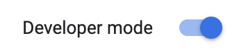
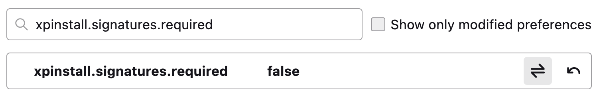
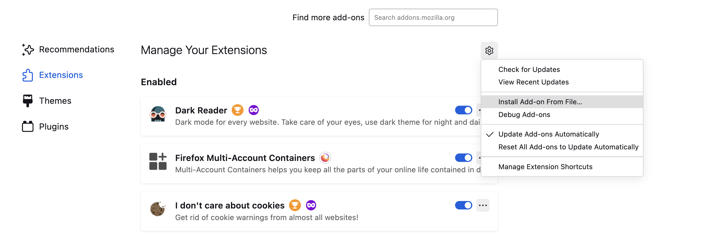

# spider-hs

A Chrome Extension that brings the power of the Project Builder to the native Hopscotch Web Editor

---

## Loading the Extension (Chromium-based Browsers)

1. Download latest `spider-chrome.zip` from the Releases Tab
2. Extract the ZIP file and store the folder somewhere
3. Go to `chrome://extensions/`
4. Turn on Developer mode on the top right 

5. Click on "Load Unpacked" 

6. Choose the `spider-chrome` folder

You should get a message that says "Extension Loaded"

## Loading the Extension (Firefox)

> **Disclaimer:** Loading Unsigned Extensions Requires Firefox Developer Edition

1. Download the latest `spider-firefox.xpi` from the Releases Tab
2. Go to `about:config` in Firefox Developer Edition and search for `xpinstall.signatures.required`.
3. Set the boolean value to `false`, such that it looks like this afterwards

4. Go to `about:addons` in Firefox Developer Edition
5. Click the "Install Add-on From File..."

6. Select the xpi file that you just downloaded
7. Confirm that you would like to add the extension

You should get a message that says "Spider HS was added"

## Running Development

1. Clone the repo
2. `npm install` to install dependencies
3. `npm run build` to create a build (optional). The `build` directory contains a local build for a chrome and firefox version of the extension.
4. `npm run dev` to watch changes to the `extension` directory. 
